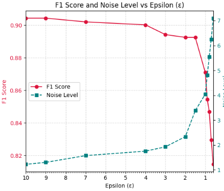
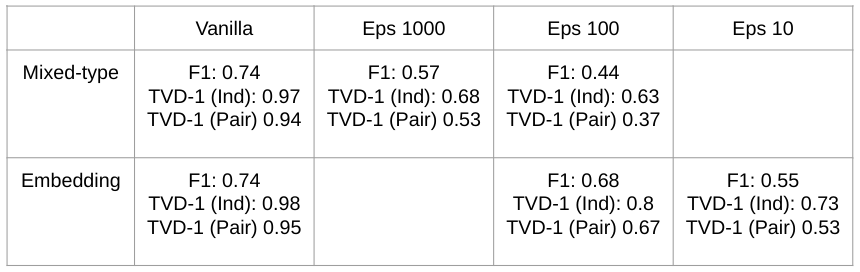

# Differentially Private TabDDPM (DP-TabDDPM): Modelling Tabular Data with Differentially Private Diffusion Models
This repository is a modified implementation of [TabDDPM](https://github.com/yandex-research/tab-ddpm), extended to support differential privacy using DP-SGD (Differentially Private Stochastic Gradient Descent). All credit for the codebase goes to [TabDDPM](https://github.com/yandex-research/tab-ddpm). 

Features:

✅ Full integration of DP-SGD for differentially private training

✅ Retains core functionality and architecture of the original TabDDPM

✅ Utilizes Noise Multiplicity as proposed by [Tim Dockhorn et al](https://arxiv.org/abs/2210.09929) 

✅ Supports common DP accounting and hyperparameter tuning

✅ Useful for research in privacy-preserving machine learning and synthetic tabular data generation


[//]: # ()
[//]: # (This is the official code for our paper "TabDDPM: Modelling Tabular Data with Diffusion Models" &#40;[paper]&#40;https://arxiv.org/abs/2209.15421&#41;&#41;)

[//]: # ()
[//]: # (<!-- ## Results)

[//]: # (You can view all the results and build your own tables with this [notebook]&#40;notebooks/Reports.ipynb&#41;. -->)

For examples pointing out the additional differentially private options and how they are executed, jump to [Examples - DP-TabDDPM](https://github.com/Friedrich-Mueller/tab-ddpm-dp?tab=readme-ov-file#examples-dp-tabddpm) 


## Setup the environment
The setup is done completely analogue to the original TabDDPM. All library version are the same. (Including an old version of Opacus)
1. Install [conda](https://docs.conda.io/en/latest/miniconda.html) (just to manage the env).
2. Run the following commands
    ```bash
    export REPO_DIR=/path/to/the/code
    cd $REPO_DIR

    conda create -n tddpm-dp python=3.9.7
    conda activate tddpm-dp

    pip install torch==1.10.1+cu111 -f https://download.pytorch.org/whl/torch_stable.html
    pip install -r requirements.txt

    # if the following commands do not succeed, update conda
    conda env config vars set PYTHONPATH=${PYTHONPATH}:${REPO_DIR}
    conda env config vars set PROJECT_DIR=${REPO_DIR}

    conda deactivate
    conda activate tddpm-dp
    ```


## Running the experiments

Please note that if you want to run the complete experiments from the [TabDDPM paper](https://arxiv.org/abs/2209.15421), such as different models (CTAB-GAN, CTAB-GAN-Plus, etc) which were used for benchmarking, you will want to use the original TabDDPM repository.

DP-TabDDPM offers the complete TabDDPM Diffusion Model functionality and additionally the option to run it with the application of differential privacy via DP-SGD.

Beware that training under DP increases runtimes significantly. Additionally, the runtime grows linearly with the of amount/value of Noise Multiplicity.

### Datasets

Nothing changed here. You can download their datasets and run them just as you could with TabDDPM. This is advisable at the very least to see how the data has to be prepared to be used with TabDDPM.

You could load the datasets with the following commands:

``` bash
conda activate tddpm-dp
cd $PROJECT_DIR
wget "https://www.dropbox.com/s/rpckvcs3vx7j605/data.tar?dl=0" -O data.tar
tar -xvf data.tar
```

### File structure

For the file structure, please refer to the [original repo](https://github.com/yandex-research/tab-ddpm?tab=readme-ov-file#file-structure)

### Examples DP-TabDDPM


<ins>Run DP-TabDDPM tuning.</ins>   

Either `--dp_eps [Int|Float]` or `--dp_noise [Int|Float]` is required.

Template and examples (`--eval_seeds` is optional):
```bash
python scripts/tune_ddpm.py [ds_name] [train_size] synthetic [catboost|mlp] [exp_name] --eval_seeds --dp_eps [epsilon]
python scripts/tune_ddpm.py [ds_name] [train_size] synthetic [catboost|mlp] [exp_name] --eval_seeds --train_dp_noise [noise]
python scripts/tune_ddpm.py wilt 3096 synthetic catboost wilt_dp_eps_9 --eval_seeds --dp_eps 9
python scripts/tune_ddpm.py wilt 3096 synthetic catboost wilt_dp_eps_9 --eval_seeds --train_dp_noise 1.063232421875
```
Note how the first example will tune a model while maintaining differential privacy with given target epsilon (here $\epsilon$ = 9).<br>
Note how the second example will tune a model while maintaining a given target noise injection (here $\sigma$ = 1.063232421875).

<ins>Run DP-TabDDPM pipeline.</ins>   

Either `--train_dp_eps [Int|Float]` or `--train_dp_noise [Int|Float]` is required.

Templates and examples (`--train`, `--sample`, `--eval` are optional, `--train_dp_eps x` is optional): 
```bash
python scripts/pipeline.py --config [path_to_your_config] --train_dp_eps  [Int|Float] --sample --eval
python scripts/pipeline.py --config [path_to_your_config] --train_dp_noise  [Int|Float] --sample --eval
python scripts/pipeline.py --config exp/wilt/wilt_dp_eps_9_best/config.toml --train_dp_eps 9 --sample --eval
python scripts/pipeline.py --config exp/wilt/wilt_dp_eps_9_best/config.toml --train_dp_noise 1.063232421875 --sample --eval
```
Note how the first example will train a model while maintaining differential privacy with given target epsilon (here $\epsilon$ = 9).<br>
Note how the second example will train a model while maintaining a given target noise injection (here $\sigma$ = 1.063232421875).

(With the current config.toml in ../wilt_dp_eps_9_best a target $\epsilon$ = 9 results in $\sigma$ = 1.063232421875 and vice versa.)  

#### Example Results (wilt dataset):

This plot demonstrates the trade-off between privacy (noise level) and utility (F1 Score) when using DP-TabDDPM on the wilt dataset. As the privacy budget $\epsilon$ decreases (moving to the right on the x-axis), the noise level $\sigma$ required for DP-SGD increases, which in turn leads to a decrease in the model's F1 score. 

Beware that this is a continuous-feature-only dataset, and different results are to be expected not only for other datasets, but presumably more importantly based on the amount and cardinality of categorical/discrete features, even to the extent that converting categorical features to continuous features a priori might be more feasible than running DP-TabDDPM on mixed-type tabular data. (See direcly below.)

<p align="center">
  
</p>

#### Example Results (churn2 embedded categoricals):

<p align="center">
  
</p>


### Examples - TabDDPM

<ins>Run TabDDPM tuning.</ins>   

Template and examples (`--eval_seeds` is optional): 
```bash
python scripts/tune_ddpm.py [ds_name] [train_size] synthetic [catboost|mlp] [exp_name] --eval_seeds
python scripts/tune_ddpm.py churn2 6500 synthetic catboost ddpm_tune --eval_seeds
```


<ins>Run TabDDPM pipeline.</ins>   

Template and examples (`--train`, `--sample`, `--eval` are optional): 
```bash
python scripts/pipeline.py --config [path_to_your_config] --train --sample --eval
python scripts/pipeline.py --config exp/churn2/ddpm_cb_best/config.toml --train --sample
```

<ins>Run evaluation over seeds</ins>   
Before running evaluation, you have to train the model with the given hyperparameters (the example above).  

Template and example: 
```bash
python scripts/eval_seeds.py --config [path_to_your_config] [n_eval_seeds] [ddpm|smote|ctabgan|ctabgan-plus|tvae] synthetic [catboost|mlp] [n_sample_seeds]
python scripts/eval_seeds.py --config exp/churn2/ddpm_cb_best/config.toml 10 ddpm synthetic catboost 5
```


--- 


If you find any errors or run into problems, please don't hesitate reaching out to me.